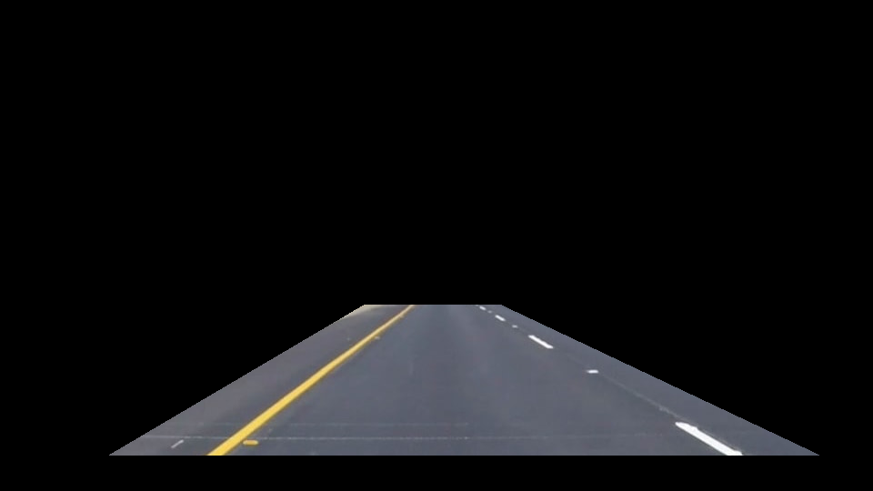

# **Finding Lane Lines on the Road**

The goals / steps of this project are the following:
* Make a pipeline that finds lane lines on the road
* Reflect on your work in a written report

---

### Reflection

### 1. Describe your pipeline. As part of the description, explain how you modified the draw_lines() function.

My pipeline consisted of 5 steps.

1. First I converted the images to HLS colorspace, and filtered for the location of yellow and white pixels using the following thresholds:

	- Yellow:
		- low: [20, 120, 80]
		- high: [45, 200, 255]
	- White:
		- low: [0, 200, 0]
		- high: [255, 255, 255]

 I used the combined white/yellow mask as my input to the next step. An example of an original image and the resulting white/yellow mask is shown below:

 
 

2. Next I took the location of white/yellow pixels and applied a mask that focused on the main lane region (or "region of interest"), similar to the example we went over in class. My mask has a few extra additions:

	- I filtered out the very bottom of the image to avoid capturing the hood of the car in the challenge video.

	- Instead of hardcoding the pixel locations of the mask, I used relative locations so that the mask could be applied to input images of different sizes (and aspects).

 An example of the mask I applied is shown below (the first picture shows the mask on the original image, while the second picture shows the mask on the white/yellow image):

 
 

3. I then tackled drawing a single line on the left and right lanes.

 I decided to split the image in half (splitting at the center of the visible/unmasked portion of the image), and focus on the left and right halves of the image separately.

 For example, to draw the right line, I blacked out all the pixels on the left half of the image. I've shown an example below. The first figure is for illustrative purposes, and shows the mask applied to the original image. The second figure is what I actually used during my analysis, with the mask applied to the white/yellow image.

 
 

4. For each half of the image, I extracted the coordinates of the white/yellow pixels and calculated the best fit line. I was concerned about using classic linear regression, because there is sometimes noise from other features on the road (like the yellow squares on either side of the lane line we want to identify in the pictures above). I didn't want the line to jump around from frame to frame based on this noise.

 Therefore, I decided to use a Huber Regressor, which is available from scikit-learn's `linear_model` package. I have not used any robust estimators like a Huber Regressor before, and I largely based my decision on the analysis shown in [this sklearn article](http://scikit-learn.org/stable/auto_examples/linear_model/plot_robust_fit.html). This was a fun opportunity to explore using new techniques! That said, I did not spend too much time exploring alternate methods for minimizing the impact of outliers -- and a Huber Regressor may be overkill. In particular, it certainly is slower than using ordinary least squares regression. If I had performance constraints, I would revisit how I implemented this step.

 After fitting the Huber Regressor, I calculated the end points of the lane line where they would intersect the original mask I used to filter the image.

 An example of the resulting line for the left side of the image is shown below:

 

5. Because I calculated an equation for the "best fit" lane lines in another step, no real modification was needed to plot the final lane lines using draw_lines(). I simply increased the line thickness from 2 to 10.

 The final results for the example image are shown below:

 

### 2. Identify potential shortcomings with your current pipeline

There are many limitations to my current approach, including:

- This method will likely fail if the car changes lanes. There are quite a few ways this will break the solution, but I'll just describe one such problem below:

	- First, the location of the lane in the image will shift. At least one lane will still be visible as the car drives over it to get to the adjacent lane. My current approach naively splits the image in half, which may bisect the shifting lane line. This will at best result in a two overlapping estimates of the same lane line. At worst, the two estimates could have vastly different angles, leading to a noisy/inaccurate/illogical result. This would also interrupt the continuity from previous/subsequent frames, so we would probably see some jitter.

	- Similarly, my method will also likely struggle with horizontal lane lines or lane lines at extreme angles (for example, if the car was at a T-intersection or making a right/left turn). The shape of my mask, the assumption that there is a "right" and "left" line, and my naive split down the middle will all cause problems.

- My method is probably not good at detecting faint or faded lane lines -- the big question here is how well calibrated my yellow and white thresholds are. In addition, if the camera or lighting changes significantly, or if the road surface changes to a much lighter concrete, my thresholds may still be insufficient even if the lane lines are adequately painted. If my thresholds are too inclusive, a wide range of pixels will be highlighted introducing significant noise. If my thresholds are too strict, I will only being able to detect a small subset of pixels and my lane line estimates may not be robust. This could manifest as a lot of jitter between frames (or it might manifest by being unable to detect a lane line at all!)

- My method doesn't use hough lines, so I cannot filter on what angle/orientation of line segments to include before calculating my best fit line. This means that if large white/yellow objects appear in an image they may have a large influence on my calculated lane line. For example, if there was a turn arrow or many horizontal dashes in the lane I have no way of filtering out those pixels beyond the coarse image mask from step 2 of the pipeline.

- My approach is likely to fail if the camera viewing angle changes too much. I did move away from hardcoding specific pixel locations for the masks that define the "region of interest" visible to my model. However, the relative proportions of the mask are still hard coded. If the camera angle shifts up or down, or has a wider/narrower range of vision then my masks might no longer be effective.

- All of the test and example images are very clean, there are no large cracks or other features in the road. But most importantly, there are no cars! The following distance is far enough from other cars that we never had to worry about a car appearing directly in the field of vision and obscuring the lane lines or adding noise to our detection algorithm. I could easily see how my approach would be thrown off if a car started driving within my unmasked "region of interest".

### 3. Suggest possible improvements to your pipeline

Obviously, there are many, many ways to make this pipeline better. I've outlined a small subset of them below:

- One approach I explored was to use hough lines derived from a canny outline of a grayscale version of the image, as in the example we went over in class. I looked at each hough line segment, and filtered out any lines at extreme angles (by looking at where they might intersect the boundaries of the image mask -- this was important for inputs like the challenge video where shadows on the road introduced a number of "lines" extending horizontally across the image). I then split the line segments into two groups: those with positive and negative slope. From here, I drew out the line segments and fit a Huber regression line to the resulting pixels using the same approach from my current pipeline.

	- The advantage here, is that I'm not making an assumption about splitting my image in half. I would much rather be able to filter on slope, and I was unhappy with the naive/arbitrary approach I use my current pipeline.

	- My biggest struggle with this approach was that the resulting lines were much noisier and the jitter from frame to frame was much more noticeable. Although the lane line estimates were never more than a few pixels off from the top and bottom of the true lane line, the way the estimate jumped from frame to frame was definitely noticeable. Depending on the constraints of how this solution will be used and what we want to optimize for, this approach could definitely be a viable alternative. It's also possible that I just needed to spend more time tuning the parameters for this approach. I ended up opting for the color threshhold without hough lines because the results looked so much better on all the test videos we were given to play around with.

	- In addition, the challenge video had a lot of additional noise in the middle of the lane that showed up in the canny boundaries and hough line segments. (The first 2 videos don't really have anything show up in the middle of the lane). One approach that reduced this noise and helped improve the jitter slightly was to introduce a modified mask -- where I blacked out a triangle in the middle of the lane. This felt pretty hacky, and makes even more assumptions about the likely location of the lane lines within the image, which is one of the reasons I decided to use the thresholded white/yellow filter instead.

	- A slightly better hybrid approach was generate canny outlines directly from the white/yellow mask. This removed the issue of noise from shadows in the road, and lead to a much more stable solution. However, it was still more jittery than fitting a regression to the the raw white/yellow pixels.

- Another limitation of the my approach is that it does a good job estimating the center of the lane line but does not really estimate the boundaries of the line -- I simply plot a line of constant width (10). I did explore an alternate method of drawing the lines to deal with this issue. After fitting the Huber lines in step 4, I partitioned the pixels from each line into two sets: those to the left and those to the right of the best fit line. I then fit secondary Huber lines to these two sets of points. The secondary lines give a better estimate of the width of the lane line, and also capture the perspective of the image (the distance between the lines gets narrower as the line gets further away). You could either return all 3 lines (left, center, right) or fill in the space between the left and right lines. One downside of this approach is that the smaller "secondary" datasets can sometimes be noisier/more sensitive to outliers, so they have a little more jitter.

- I could try to more smartly generate the boundaries of the mask that define the "region of interest" visible to my model. For example, I could try to detect if there is a car hood in the image to determine how much of the bottom to filter out. I could also try to detect obstacles like cars that might show up in the image, and make sure that they are masked out.

- Lane lines aren't always straight, and indeed some of the test images had curved lane lines. Another improvement would be to adjust the lane line estimates that are further out from the car, to more accurately capture curves in the road. The simplest approach would be to split up the image (along the y-axis) and plot several different line segments. A more complex approach would be to smoothly combine these separate estimates into one curve. Reducing the amount of data used to estimate each line could introduce more noise to the estimates, so you would definitely have to pay attention to the inputs/filters that are used in the pipeline and how you train each line segment.
